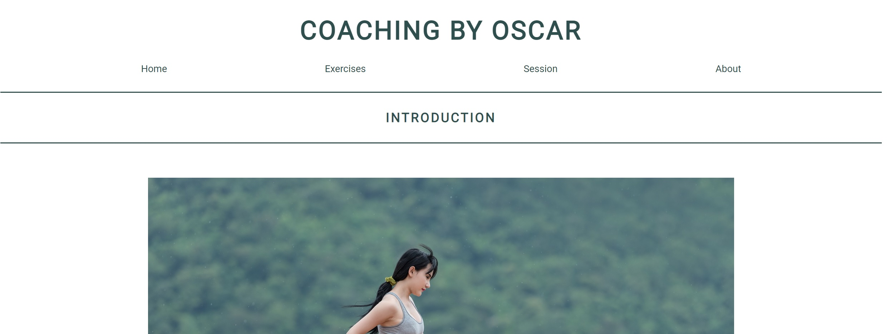
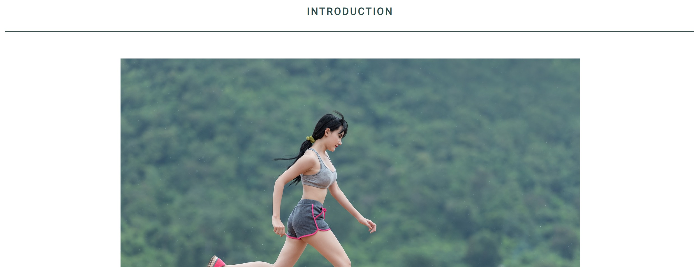
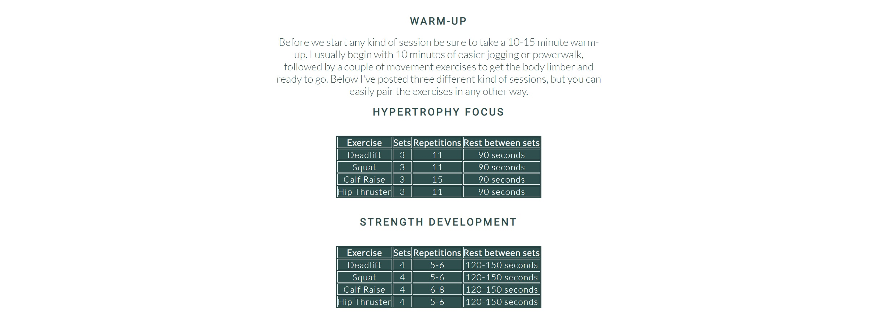
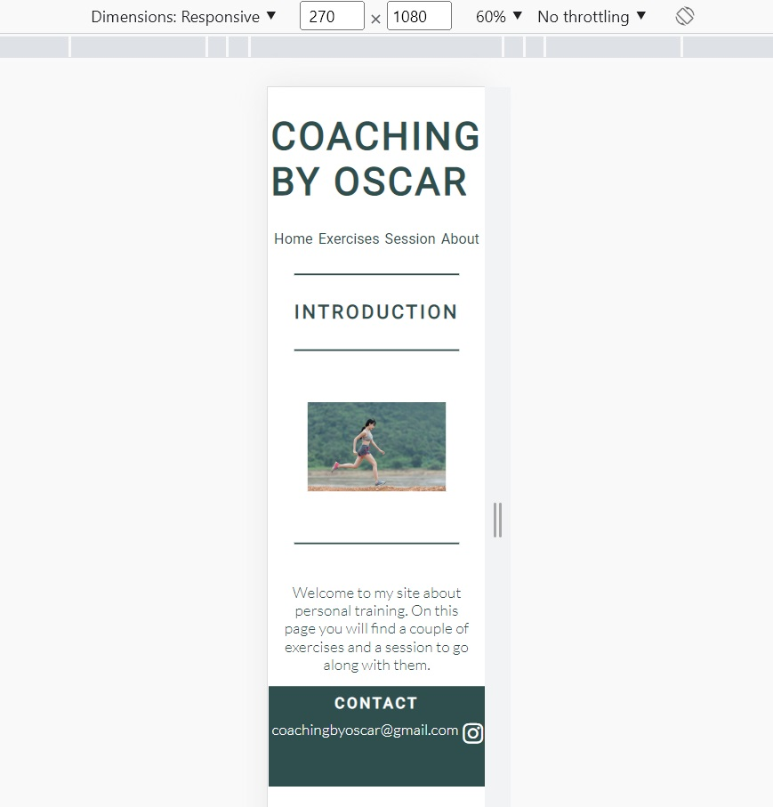
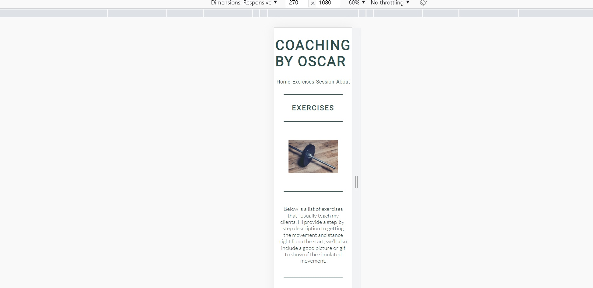
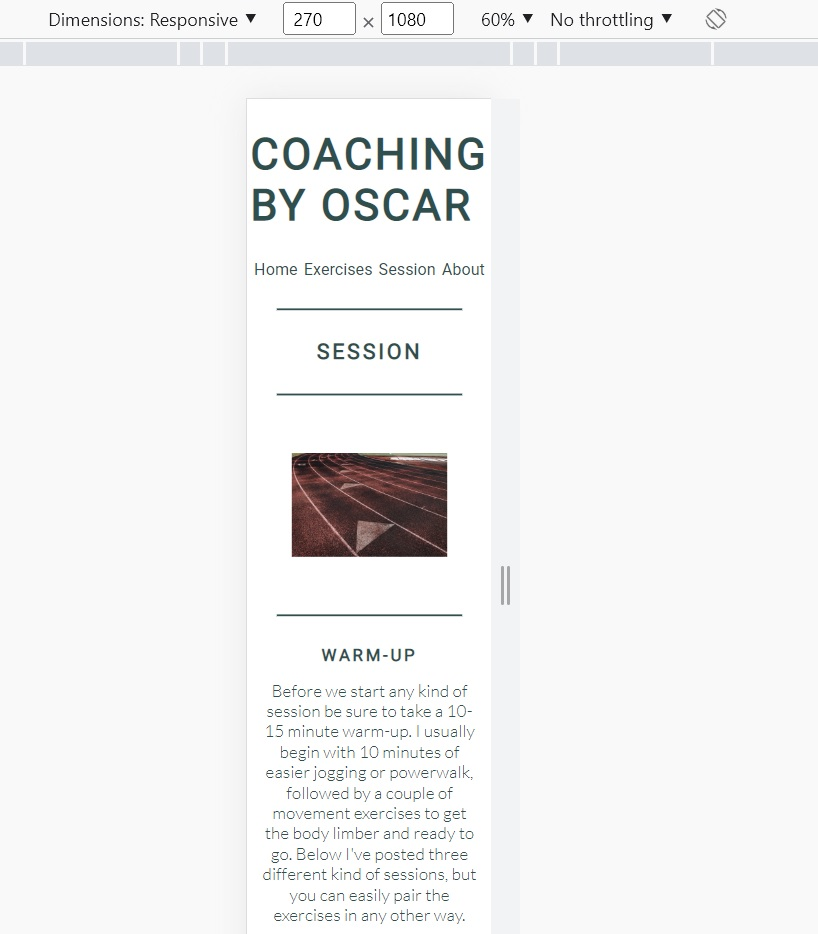
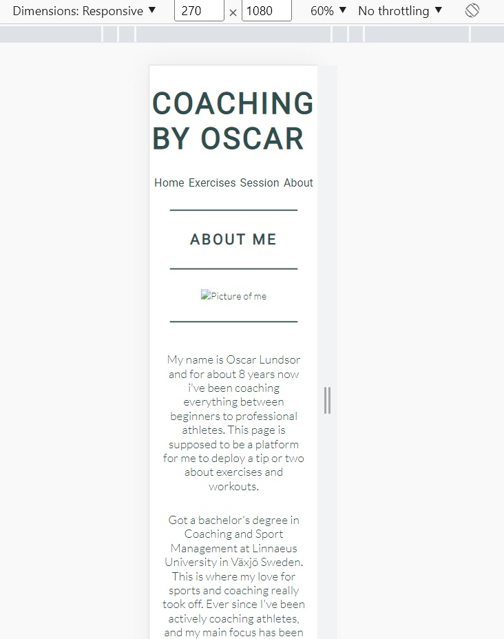

# Coaching by Oscar

In this section, you will include one or two paragraphs providing an overview of your project. Essentially, this part is your sales pitch. At this stage, you should have a name for your project so use it! Don’t introduce the project as a Portfolio project for the diploma. In this section, describe what the project hopes to accomplish, who it is intended to target and how it will be useful to the target audience. 

For example; Love Running is a site that hopes to help keep people motivated to meet up for runs on a regular basis in Dublin, Ireland. The site will be targeted toward runners who are looking for a way to socialise and keep themselves fit. Love Running will be useful for runners to see exactly when and where they should be to join the running club. 

Coaching by Oscar is a site dedicated to PT-clients of mine, both new and old. It's designed to inspire them with sessions they've already done or maybe some they haven't yet got around to trying. 
The site contains both a page for the actual session and a page with instructions.

## Features 

In this section, you should go over the different parts of your project, and describe each in a sentence or so. You will need to explain what value each of the features provides for the user, focusing on who this website is for, what it is that they want to achieve and how your project is the best way to help them achieve these things.

### Existing Features

- __Navigation Bar__

  - Featured on all four pages, the full responsive navigation bar includes links to the Home page, Exercise list, Session page and About me page and is identical in each page to allow for easy navigation.
  - This section will allow the user to easily navigate from page to page across all devices without having to revert back to the previous page via the ‘back’ button. 
  - I've also included so that the title also takes you back the Home page.

- __The hero images__

  - The hero image on the Home page is supposed to symbolize the freedom of running and working out.
  - Each page has a picture symbolizing the pages subject, like exercises and session have a barbell and track field respectively.

- __Introduction page__

  - The purpose of the introduction page is give the reader a soft spot to land on before choosing which way they wanna go first (exercises/sessions/about)

- __Exercises page__

  - Here the user gets information on the different kind of exercises contained in the sessions.
  - Every exercises is followed by both an instruction and a GIF showing off the movement. 

- __Session page__

  - The sessions you find here are session tried by clients both old and new.
  - Sessions are divided into different kind of groups based on what you want to achieve.
  - Tables are made for each session with information on what's included in your workout.

  

- __About page__

  - Here on the About page you can find more information about med as a PT and my earlier background.

  

- __The Footer__ 

  - The footer section includes links to the relevant social media sites for Coaching b Oscar. The links will open to a new tab to allow easy navigation for the user. 
  - The footer is valuable to the user as it encourages them to keep connected via social media, it's also accessible on all of the pages.

### Features Left to Implement

- Additional sessions or maybe a folder for them, some way categorize them.
- Additional exercises and a way to categorize them.
- A feature to submit a contact request.

## Testing 

- __Home page__

    - Tested the logo link to the home page.
    - Tested all the nav links without any problem.
    - Tested the footer link to instagram, it opened an external window.
    - Tested the responsiveness down to 270px without a problem.

- __Exercises page__

    - Tested the logo link to the home page.
    - Tested all the nav links without any problem.
    - Tested the footer link to instagram, it opened an external window.
    - Tested the responsiveness down to 270px without a problem.

- __Session page__

    - Tested the logo link to the home page.
    - Tested all the nav links without any problem.
    - Tested the footer link to instagram, it opened an external window.
    - Tested the responsiveness down to 270px without a problem.

- __About page__

    - Tested the logo link to the home page.
    - Tested all the nav links without any problem.
    - Tested the footer link to instagram, it opened an external window.
    - Tested the responsiveness down to 270px without a problem.

### Validator Testing 

- HTML
  - No errors were returned when passing through the official [W3C validator](https://validator.w3.org/nu/?doc=https%3A%2F%2Frakdoslover.github.io%2FProject-3%2Findex.html)
- CSS
  - No errors were found when passing through the official [(Jigsaw) validator](https://jigsaw.w3.org/css-validator/validator?uri=https%3A%2F%2Frakdoslover.github.io%2FProject-3%2Findex.html&profile=css3svg&usermedium=all&warning=1&vextwarning=&lang=sv#errors)

### Unfixed Bugs

You will need to mention unfixed bugs and why they were not fixed. This section should include shortcomings of the frameworks or technologies used. Although time can be a big variable to consider, paucity of time and difficulty understanding implementation is not a valid reason to leave bugs unfixed. 

## Deployment

This section should describe the process you went through to deploy the project to a hosting platform (e.g. GitHub) 

- The site was deployed to GitHub pages. The steps to deploy are as follows: 
  - In the GitHub repository associated with the Project-3, navigate to the Settings tab.
  - From the branch section drop-down menu, select the Main Branch and press save.
  - Once the Main branch has been selected, the page will be automatically refreshed with a detailed ribbon display to indicate the successful deployment. 

The live link can be found here - https://rakdoslover.github.io/Project-3/

## Credits  

### Content 

- Got the tip on basing the structure on the flex-function from my mentor Lauren Nicole. She gave me links to sites like [CSS-TRICKS](https://css-tricks.com/snippets/css/a-guide-to-flexbox/) & [W3 Schools](https://www.w3schools.com/css/css3_flexbox_responsive.asp).
- I've also used the template made by CI published on Github as a layout, can be found here [GitHub](https://github.com/Code-Institute-Solutions/love-running-2.0-sourcecode).
- The icons in the footer were taken from [Font Awesome](https://fontawesome.com/).

### Media

- The photos used on the home, exercise, session are fetched from [Pixabay](https://pixabay.com) & [Stocksnap](https://stocksnap.io/)
- The moving images (GIFs) are old copies I've gotten thourgh my line of work. But the source can be found on pages such as [Gym Visual](https://gymvisual.com)
- The photo of me is taken from my own folders.

## Other General Project Advice

Below you will find a couple of extra tips that may be helpful when completing your project. Remember that each of these projects will become part of your final portfolio so it’s important to allow enough time to showcase your best work! 

- One of the most basic elements of keeping a healthy commit history is with the commit message. When getting started with your project, read through [this article](https://chris.beams.io/posts/git-commit/) by Chris Beams on How to Write  a Git Commit Message 
  - Make sure to keep the messages in the imperative mood 

- When naming the files in your project directory, make sure to consider meaningful naming of files, point to specific names and sections of content.
  - For example, instead of naming an image used ‘image1.png’ consider naming it ‘landing_page_img.png’. This will ensure that there are clear file paths kept. 

- Do some extra research on good and bad coding practices, there are a handful of useful articles to read, consider reviewing the following list when getting started:
  - [Writing Your Best Code](https://learn.shayhowe.com/html-css/writing-your-best-code/)
  - [HTML & CSS Coding Best Practices](https://medium.com/@inceptiondj.info/html-css-coding-best-practice-fadb9870a00f)
  - [Google HTML/CSS Style Guide](https://google.github.io/styleguide/htmlcssguide.html#General)

Getting started with your Portfolio Projects can be daunting, planning your project can make it a lot easier to tackle, take small steps to reach the final outcome and enjoy the process! 